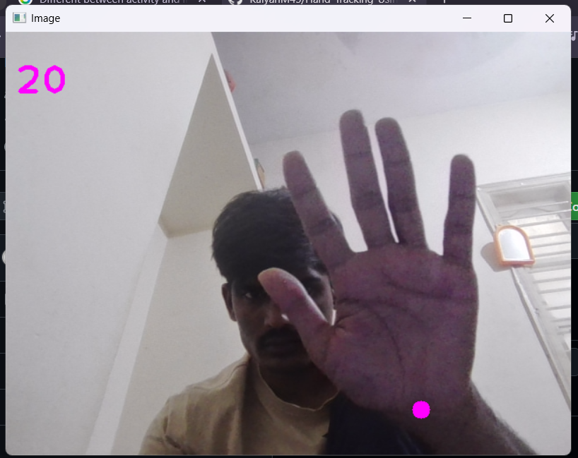
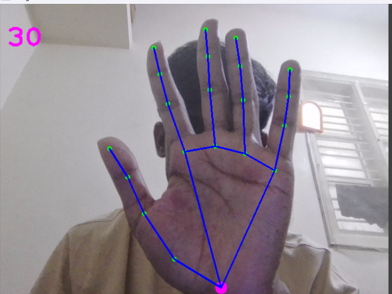
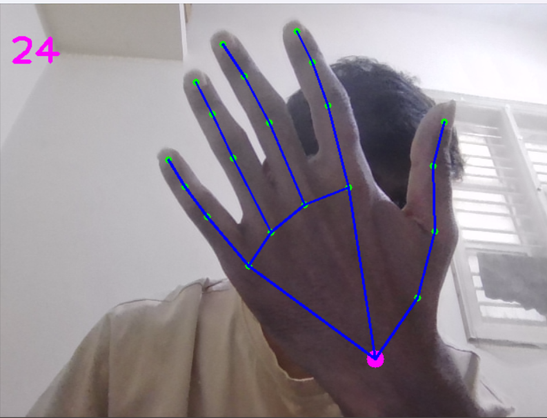

# 🖐️ Hand Tracking Using OpenCV & MediaPipe

<p align="center">
  
</p>

---

## 🚀 Project Overview
This project is a **real-time hand tracking system** built using **OpenCV** and **MediaPipe**.  
It detects and visualizes **21 hand landmarks** including fingers and palm with high accuracy.

---

## 🎯 Applications
- 🤖 Computer Vision Projects  
- ✋ Gesture Recognition Systems  
- 📊 AI/ML Portfolio Projects  
- 🕶️ AR/VR Interaction  

---

## ✨ Features
- ✅ Real-time hand detection  
- ✅ 21 landmark tracking  
- ✅ Smooth skeleton visualization  
- ✅ FPS counter  
- ✅ Webcam + video support  
- ✅ Pause (`P`) and Quit (`Q`)  
- ✅ Prints landmark coordinates  

---

## 🧠 How It Works
- MediaPipe loads a **pre-trained hand tracking model**
- OpenCV captures video frames
- Each frame is processed:
  - 🟢 Green dots → Landmarks  
  - 🔵 Blue lines → Connections  
  - 🟣 Magenta dot → Wrist  
- FPS is calculated and displayed  

---

# 📸 Output Preview

## 🔹 Hand Tracking (Normal Mode)


👉 Stable detection with clear landmark connections  

---

## 🔹 High FPS Detection


👉 Smooth tracking with better performance  

---

## 🔹 Minimal Detection Mode


👉 Only essential tracking (wrist-focused)  

---

## 🔹 Low Light Performance


👉 Shows performance drop in low lighting  

---

# 🎥 Demo Video

<video src="Assets/recoed1.mp4" controls width="600"></video>

👉 Demonstrates real-time tracking  

---

## ⚙️ Installation & Setup

### 1️⃣ Clone Repository
```bash
git clone https://github.com/Pawankumar16122114/Hand_Gesture_Using_OpenCV.git
cd Hand_Gesture_Using_OpenCV
2️⃣ Create Virtual Environment
python -m venv .venv

Activate:

.venv\Scripts\activate   # Windows
3️⃣ Install Dependencies
pip install -r requirements.txt
▶️ How to Run
🎥 Webcam Mode
python app.py
📁 Video Mode
python "Hand Tracking from Media .py"
📦 Requirements
Python 3.7+ (Recommended: 3.11)
OpenCV 4.13+
MediaPipe 0.10.33+

Install manually:

pip install opencv-python mediapipe
🛠️ Project Structure
📦 Hand_Gesture_Using_OpenCV
 ┣ 📜 app.py
 ┣ 📜 Hand Tracking from Media.py
 ┣ 📜 requirements.txt
 ┣ 📂 Assets
 ┃ ┣ image1.png
 ┃ ┣ image2.png
 ┃ ┣ image3.png
 ┃ ┗ recoed1.mp4
 ┗ 📜 README.md
⚡ Performance
Condition	Accuracy
Good Lighting	⭐⭐⭐⭐⭐
Medium Lighting	⭐⭐⭐⭐
Low Lighting	⭐⭐⭐
🧪 Troubleshooting

❌ Only one dot showing?
✔ Ensure all 21 landmarks are drawn

❌ Camera not opening?
✔ Check webcam permissions

❌ Low accuracy?
✔ Improve lighting

💡 Future Enhancements
✋ Gesture recognition
🖱️ Hand-controlled mouse
🎮 Game control using gestures
🤖 Sign language detection
⭐ Support

If you like this project:
👉 Star ⭐ the repo
👉 Share 🔁

👨‍💻 Author

Pawankumar Bukka(https://github.com/Pawankumar16122114)
